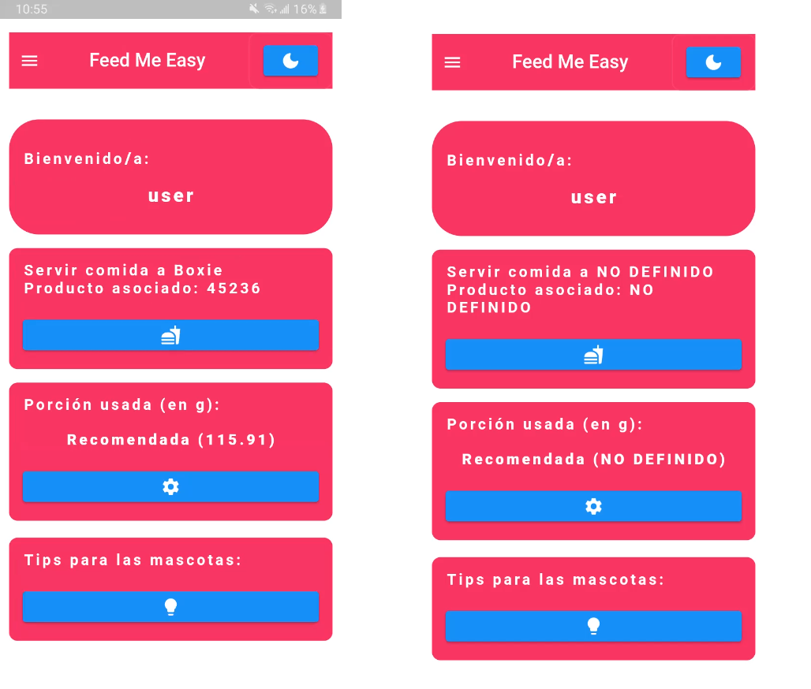

# **Feed Me Easy**
Aplicación móvil desarrollada en Flutter la cual consiste en conectarse con un servidor en la nube (AdafruitIO) el cual está conectado con un microcontrolador para servir comida a una mascota, como un perro o gato.

Se utilizó un Backend alojado en Heroku, al cual se le mandaba información acerca del usuario y su mascota, estos datos eran almacenados en una base de datos en Azure.

La extracción de la información por medio de SQL permite a la aplicación reconocer las mascotas de los usuarios y calcular la comida que se le debe proporcionar (datos enviados a AdafruitIO).

#### Tecnologías y conocimientos empleados
- Flutter
- Heroku
- Adafruit API
- Microsoft Azure
- Protocolo MQTT
- Dispositivo IoT
- SQL

#### Capturas de pantalla importantes de la aplicación

Registro e inicio de sesión

Side Bar

Pantallas de ingreso de datos

Menú principal

